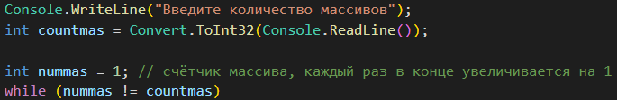

# Описание решения задачи
## Задача : Написать программу, которая из имеющегося массива строк формирует новый массив из строк, длина которых меньше, либо равна 3 символам. Первоначальный массив можно ввести с клавиатуры, либо задать на старте выполнения алгоритма. При решении не рекомендуется пользоваться коллекциями, лучше обойтись исключительно массивами.

## Этапы создания
- Первый этап. Создание массива и вывод его в консоль.


- Второй этап. Создание массива который будет состоять из элементов первого массива

```sh
Отфильтрованный массив будет состоять из не более чем три элемента.
```
- Третий этап.  Повтор опирации для трёх массивов элементы которых введёт пользователь.

